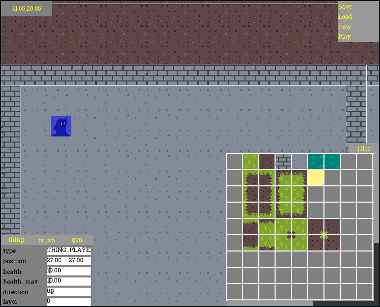

# Magos



This is more of a engine than a game. Just for fun, actually.

The objective of this project it was to make a cross-platform project, that
runs on PC and Raspberry Pi 4, so the performance target is a Raspberry Pi 4
(this means your PC will likely have enough juice to run it unless you are
using a dinosaur pre-2000 PCs, which in case: based).

## Dependencies
* OpenGL ES 3.1
* SDL2 

# Building

Just use ```make```.

## Important variables.
* CFLAGS: Compilation flags, the object-code compilation stage arguments
* LDFLAGS: Link flags, for libraries

Remember to set your SDL2 to the link path:
```
$ export CFLAGS=`pkg-config --cflags sdl2`
$ export LDFLAGS=`pkg-config --libs sdl2`
```

Also remember to add ```-lm``` to your LDFLAGS if you use glibc.

## Nice flags to help with stuff

* SANITIZE: Set it to "yes" to add sanitization options to help you clean your
  memory mess
* DEBUG: Set it to "yes" to add debug options to help you clean your code mess

## License

The license is MIT. Just do whatever you want, just don't lie about the source
origin and you should be fine, at least respect that, you sick.
